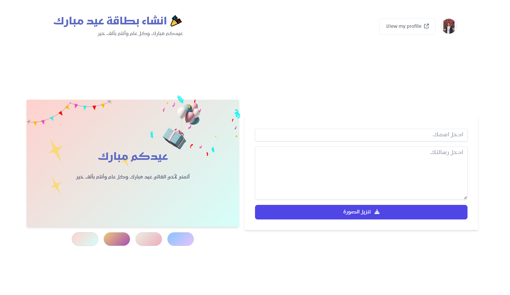

# 🎉 Eid Filter Greeting Card Generator 💌

This is a React.js project that allows users to create and share personalized greeting cards for Eid using custom filters and HTML2Canvas library.

## 🚀 Features

- Add your own text and custom message to the card
- Save your greeting card as a PNG image

## 💻 Installation

1. Clone the repository: `https://github.com/alihatem360/greeting-card`
2. Install the dependencies: `npm install`

## 📝 Usage

1. Run the development server: `npm start`
2. Open the app in your browser at `http://localhost:3000`
3. Create your own greeting card using the custom filters and text options
4. Save your greeting card as a PNG image

## 🤝 Contributing

Contributions are always welcome! If you'd like to contribute to this project, please fork the repository and submit a pull request.

## 🙏 Credits

- [React.js](https://reactjs.org/)
- [Tailwind CSS](https://tailwindcss.com/)
- [HTML2Canvas library](https://html2canvas.hertzen.com/)
